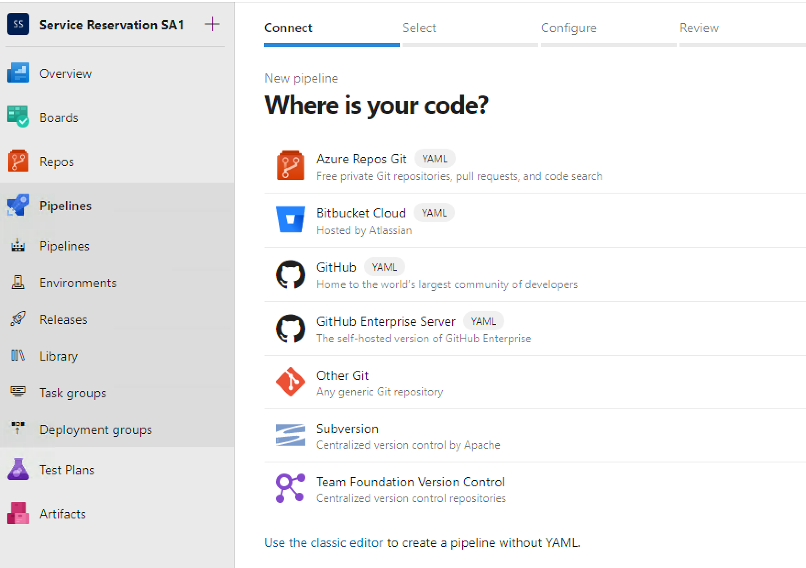
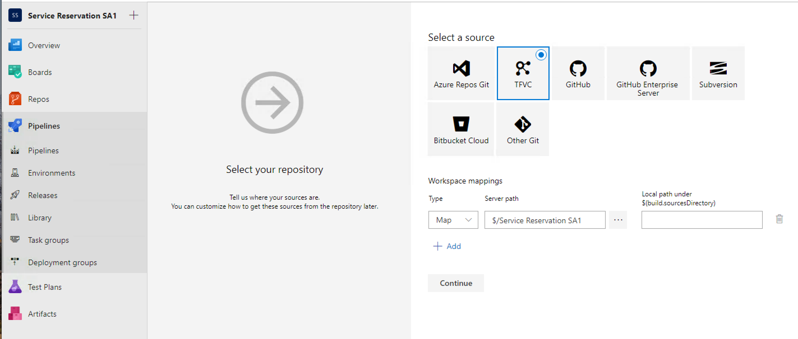
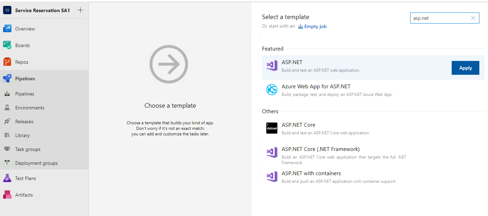
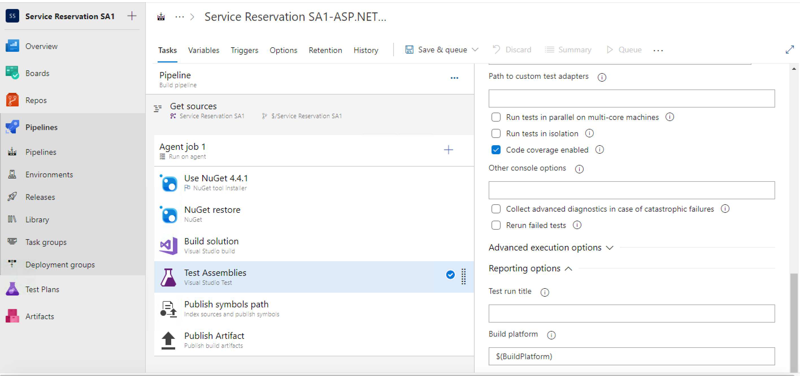
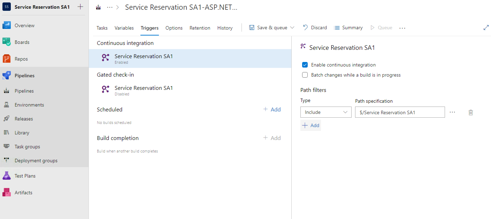
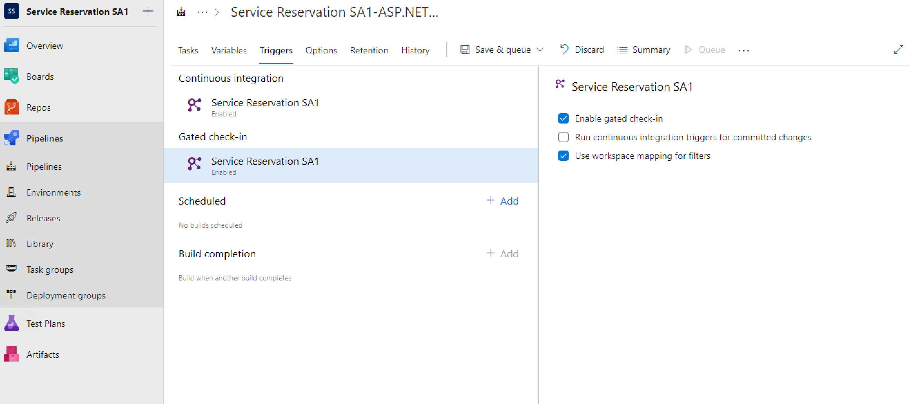
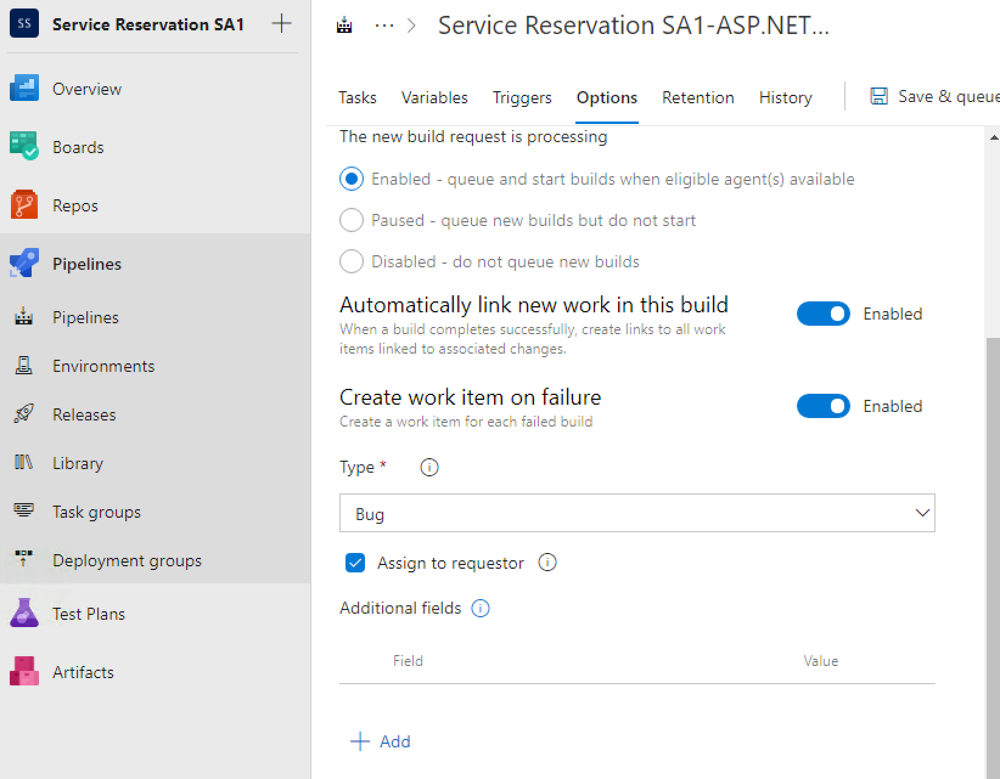
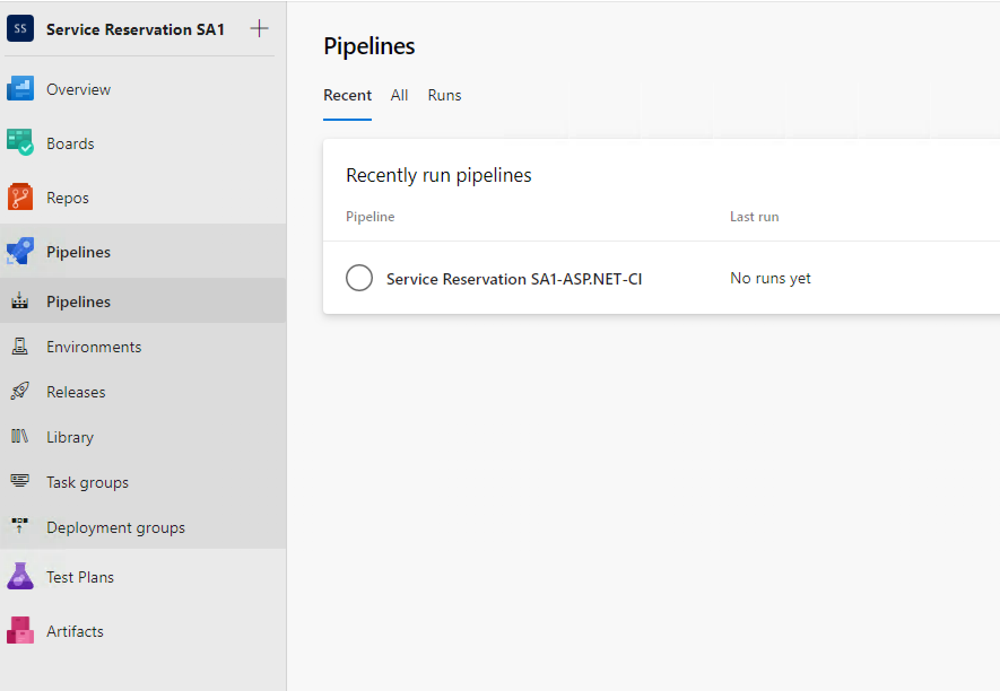

## Login to Remote Windows


### 1. Remote Desktop Login credentials

```bash
IP: <provided_ip>
Username: administrator
Password: JustM300
```

This will take you to the remote windows machine.
<br><br>
In the chrome browser, login to the azure devops

### 2. Azure DevOps Login credentials

```browser
URL: https://devopsclassroom.visualstudio.com/
Username: DevOpsStudent@Outlook.com
Password: JustM300
```

This will take you to the home page of Azure DevOps.

<kbd></kbd>


### 3. Create a Project

By providing the following attributes

```
Project name: ServiceReservation<your_name>
* choose private *
Version Control: Team Foundation Version Control
Work Item process: Agile
```

<kbd></kbd>


### 4. Add widget

1.	Click on the <b>Dashboards</b> tab, <b>Add Widget</b>, search for <b>Visual Studio Shortcuts</b> and <b>Add</b> it to the dashboard. You may also add couple more widgets in the dashboard.
2.	After adding all widgets, do <b>done editing</b>


### 5. Explore Features
1.	<b>Repos</b> tab.  This is where the source code repository is, the Team Foundation Server version control where you upload code & check it into source control.
2.	<b>Boards</b> tab. This is where all work items are maintained
3. <b>Backlogs</b> menu in the <b>Boards</b> tab. This is where we add new User Stories to our product backlog. This is also where we upload these User stories to the iterations of our sprints.
4. <b>Pipelines</b> tab.  This is where we will create build definitions.
5. There is a <b>Wiki</b> tab in <b>Overview</b>. If we have any issues or information that we want to share with our team, we can create a Wiki here. If we have a new way to automate something that will save everybody time, or we have discovered a more efficient process for product delivery, it can be documented here.


### 6. Create a Build Definition

Go to the <b>Pipelines</b> tab.
<br>Click the **Create Pipeline** button.

#### Where is your code --> Choose **Team Foundation Version Control**

<kbd></kbd>

#### Select a source  --> Choose **TFVC** again

<kbd></kbd>

#### Select a template --> Search or choose **ASP.NET** project and click Apply

<kbd></kbd>

The Build Definition Name property will be set to ```Service Reservations {YourName}-ASP.NET-CI``` by default


### 7. Configure the Build Definition

#### Enable Code coverage

On the **Task** tab, click on **Test Assemblies**. Scroll down until you see the “**Code coverage enabled**” option. Check the corresponding checkbox.
<br>Click the dropdown next to Save and Queue and Select **Save** to save the Build Definition.
Note:- **DO NOT ```Save and Queue```**, the build will fail because you do not have any code yet


<kbd></kbd>

#### Enable CI Build Trigger

Navigate to the **Triggers** tab. Enable the **Continuous Integration Trigger** by flipping the switch under Enable this Trigger that says “Disabled” to the “Enabled” position.


<kbd></kbd>


#### Enable Gated Checkin Trigger

Navigate to the **Triggers** tab. Enable the **Gated check-in** by checking the box. Leave everything as-is

<kbd></kbd>

<br>Click the dropdown next to Save and Queue and Select **Save** to save the Build Definition.
Note:- **DO NOT ```Save and Queue```**, the build will fail because you do not have any code yet


#### Enable Bug Task on Build Failure

Navigate to the **Options** tab. Enable **Create work item on failure**. Default option is to create a bug and assign to the requestor, leave as-is

<kbd></kbd>

<br>Click the dropdown next to Save and Queue and Select **Save** to save the Build Definition.
Note:- **DO NOT ```Save and Queue```**, the build will fail because you do not have any code yet

Finally click on the Pipelines again to see the list of build pipelines. Since the pipeline has not been run yet, it will show ```no runs yet```

<kbd></kbd>


