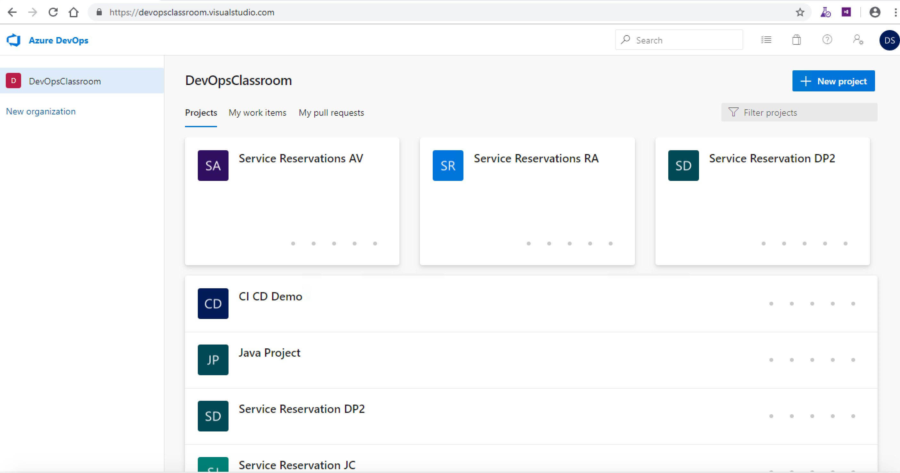
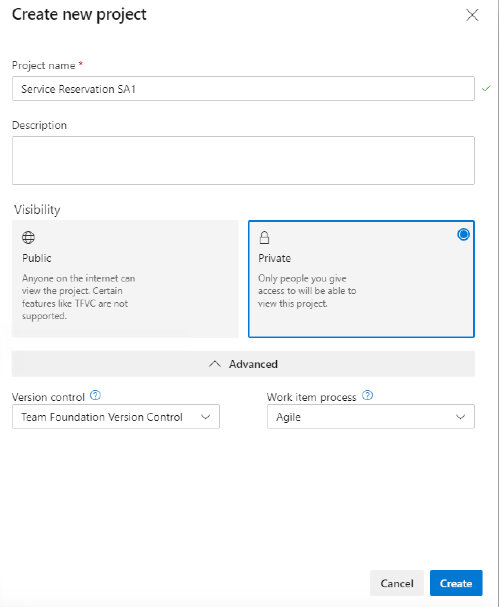

## Login to Remote Windows


### 1. Remote Desktop Login credentials

```bash
IP: <provided_ip>
Username: administrator
Password: JustM300
```

This will take you to the remote windows machine.
<br><br>
In the chrome browser, login to the azure devops

### 2. Azure DevOps Login credentials

```browser
URL: https://devopsclassroom.visualstudio.com/
Username: DevOpsStudent@Outlook.com
Password: JustM300
```

This will take you to the home page of Azure DevOps.




### 3. Create a Project

By providing the following attributes

```
Project name: ServiceReservation<your_name>
* choose private *
Version Control: Team Foundation Version Control
Work Item process: Agile
```

<kbd></kbd>


### 4. Add widget

By prov