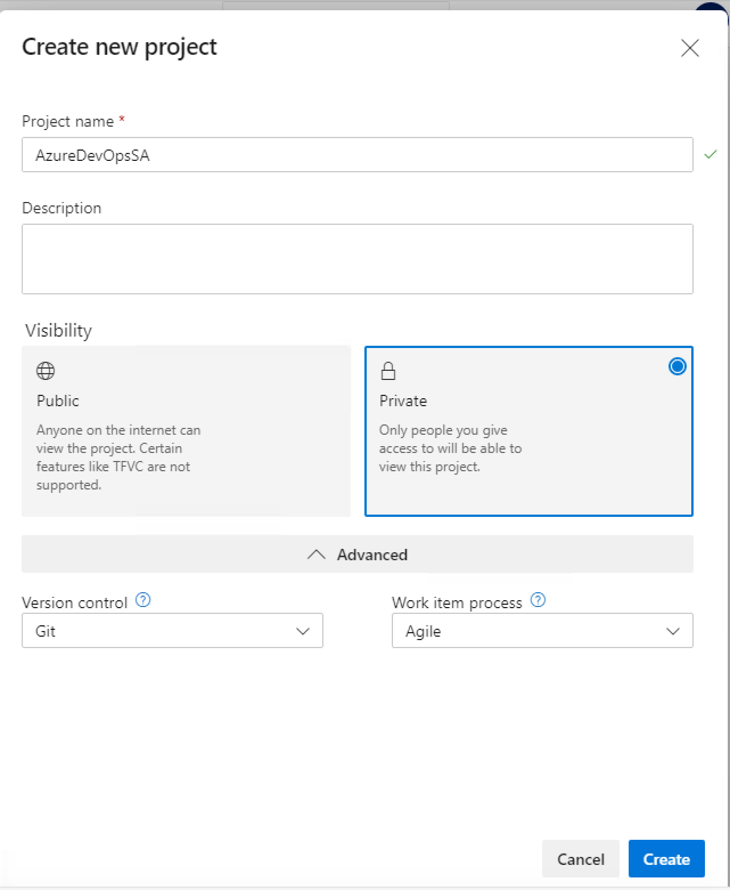

## Login to Remote Windows


### 1. Remote Desktop Login credentials

```bash
IP: <provided_ip>
Username: administrator
Password: JustM300
```

This will take you to the remote windows machine.
<br><br>
In the chrome browser, login to the azure devops

### 2. Azure DevOps Login credentials

```browser
URL: https://devopsclassroom.visualstudio.com/
Username: DevOpsStudent@Outlook.com
Password: JustM300
```

This will take you to the home page of Azure DevOps.

<kbd></kbd>


### 3. Fork git project
Source project:- ```https://github.com/shekhar2010us/pipeline-java```


### 4. Create a Azure DevOps Project

By providing the following attributes

```
Project name: AzureDevOps<your_name>
* choose private *
Version Control: Git
Work Item process: Agile
```

<kbd></kbd>


### 4. Add widget

1.	Click on the <b>Dashboards</b> tab, <b>Add Widget</b>, search for useful widgets like ```deployment status``` and ```build history```, and add them to dashboard
2.	After adding all widgets, do <b>done editing</b>


### 5. Explore Features
1.	<b>Repos</b> tab.  This is where the source code repository is, the Team Foundation Server version control where you upload code & check it into source control.
2.	<b>Boards</b> tab. This is where all work items are maintained
3. <b>Backlogs</b> menu in the <b>Boards</b> tab. This is where we add new User Stories to our product backlog. This is also where we upload these User stories to the iterations of our sprints.
4. <b>Pipelines</b> tab.  This is where we will create build definitions.
5. There is a <b>Wiki</b> tab in <b>Overview</b>. If we have any issues or information that we want to share with our team, we can create a Wiki here. If we have a new way to automate something that will save everybody time, or we have discovered a more efficient process for product delivery, it can be documented here.


### 6. Create a Build Definition

Go to the <b>Pipelines</b> tab.
<br>Click the **Create Pipeline** button.

#### Where is your code --> Choose **Github**

<kbd></kbd>

#### Authorize github

<kbd></kbd>

** Note:- Sometimes, it throws error while authorizing git from azure devops. In that case, open a new tab in the windows virtual machine and sign in your git account.

In that case, the authorization will be easier.

<kbd></kbd>


#### Select repository
Choose the project ```pipeline-java```
<kbd></kbd>


#### Authorize to create Azure Yaml
```Approve and Install```
<kbd></kbd>

To run Github projects in Azure DevOps, Azure use Yaml configuration which needs to reside in the codebase.


#### Configure Pipeline
```Choose Maven```
<kbd></kbd>


#### Review your Pipeline Yaml
```Save``` -- Just save, do not **Save & Run** yet
<kbd></kbd>


### 7. Check and Run the Build Manually
```Run the Pipeline```
<kbd></kbd>

<kbd></kbd>

Wait until the job is finished and check logs


### 8. Change the code in git

If you change anything in the codebase and check-in your code, a build will be automatically triggered

<kbd></kbd>


### 9. Define Release Pipeline
#### 9a.
```Pipelines --> Release --> New Pipeline```

#### 9b. 
Apply ```Azure App Service Deployment```

<kbd></kbd>

#### 9c.
Click on ```Stage 1```
<br>Authorize azure.com

<kbd></kbd>

```
# use these credential
Username: DevOpsStudent@Outlook.com
Password: JustM300
```

Other parameters in the form

```
App Type: Web App on Linux 
App Service Name: srsa
```

and
```save```

<kbd></kbd>


#### 9d. Setup the artifact
click on pipeline again and ```Add an artifact```

<kbd></kbd>

<kbd></kbd>


#### 9e. Turn on Continuous Deployment Trigger

<kbd></kbd>

and ```save```


#### 9f. Create Release
Choose all stages you want in the release. In this case, we only have stage 1

<kbd></kbd>

```create```


#### 9g. Manual Deploy
Pipelines --> Releases --> Release-1
```deploy```
<kbd></kbd>


```Check stage logs```


### 9. CICD

Now if you change any code in git, this will trigger auto CI and auto CD

TEST!!!!